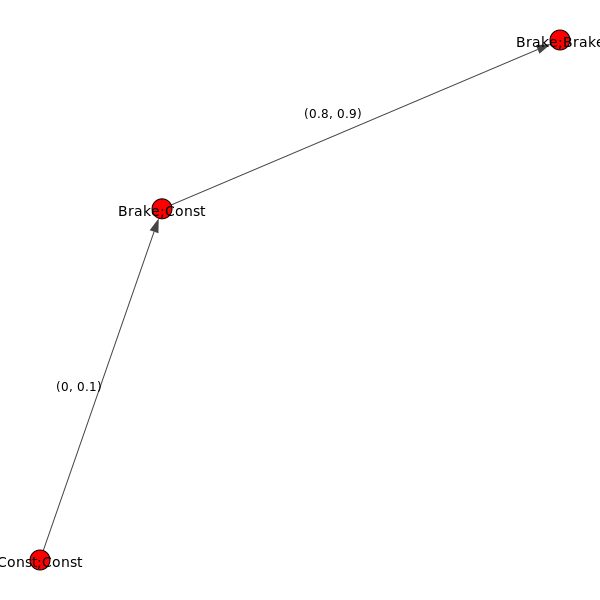
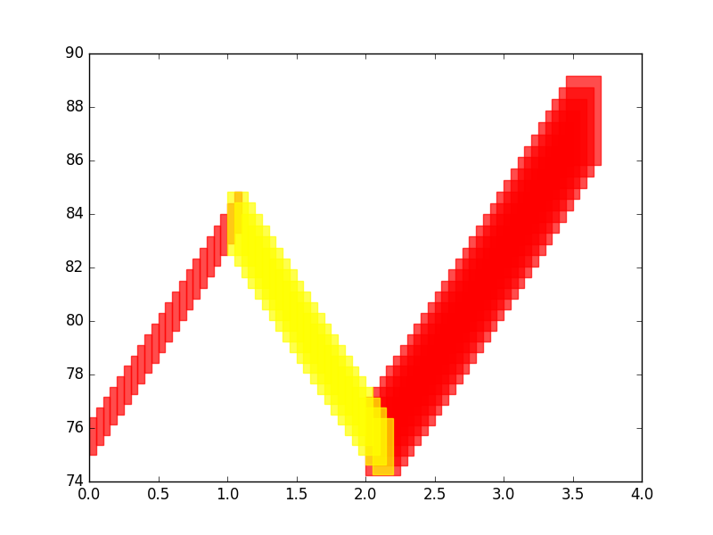

DryVR's Language
=======================

In DryVR,  hybrid systems are modeled as as a combination of a white-box that specifies the mode switches (:ref:`transition-graph-label`) and a black-box that can  simulate the continuous evolution in each mode (:ref:`black-box-label`). 

.. _black-box-label:

Black-box Simulator
^^^^^^^^^^^^^^^^^^^^^^^^
The black-box simulator for a (deterministic and prefix-closed) set  takes as input a mode label, an initial state :math:`x_0`, and a finite
sequence of time points :math:`t_1, \ldots, t_k`, and returns a sequence of
states :math:`sim(mode,x_0,t_1), \ldots, sim(mode,x_0,t_k)`
as the simulation trajectory of the system in the given mode starting from :math:`x_0` at the time points :math:`t_1, \ldots, t_k`.

In DryVR, the connection with the black-box simulator is through a simulation function: ::

	TC_Simulate(Modes,initialCondition,time_bound)

Given the mode name "Mode", initial state "initialCondition"  and time horizon "time\_bound", the function TC\_Simulate should return an python array of the form: ::

	[[t_0,variable_1(t_0),variable_2(t_0),...],[t_1,variable_1(t_1),variable_2(t_1),...],...]

Once you create the TC_Simulate function and corresponding input file, you can run DryVR to check the safety of your system. To connect DryVR with your own black-box simulator, please refer to section :ref:`advance-label` for more details.

.. _transition-graph-label:

Transition Graph
^^^^^^^^^^^^^^^^^^^^^^^^^

	The transition of Automatic Emergency Braking System

A transition graph is a labeled, directed acyclic graph as shown on the right. The vertex labels (red nodes in the graph) specify the modes of the system, and the edge labels specify the transition time from the predecessor node to the successor node. 

The transition graph shown on the right defines an automatic emergency braking system. Car1 is driving ahead of Car2 on a straight lane. Initially both car1 and car2 are in the constand speed mode (Const;Const). Within short amount of time ([0,0.1]s) Car1 transite into brake mode while Car2 remains in the cuise mode (Brk;Const). After [0.8,0.9]s, Car2 will react by braking as well so both cars are in the brake mode (Brk;Brk).

The transition graph will be generated automatically by DryVR and stored in the tool's root directory as curgraph.png

Input Format
^^^^^^^^^^^^^^^^^^^^^^^^^

The input for DryVR should be like ::

	vertex:[transition graph vertex labels (modes)]
	edge:[transition graph edges, (i,j) means there is a directed edge from vertex i to vertex j]
	transtime:[transition graph edge labels (transition times)]
	initialSet:[two arrays defining the lower and upper bound of each variable]
	unsafeSet:@[mode name]:[unsafe region]
	timeHorizon:[Time bound for the verification]
	directory: directory of the folder which contains the simulator for black-box system

Example input for the Automatic Emergency Braking System ::

	vertex:["Const;Const","Brk;Const","Brk;Brk"]
	edge:[(0,1),(1,2)]
	transtime:[(0,0.1),(0.8,0.9)]
	initialSet:[[0.0,-23.0,0.0,1.0,0.0,-15.0,0.0,1.0],[0.0,-22.8,0.0,1.0,0.0,-15.0,0.0,1.0]]
	unsafeSet:@Allmode:And(v2-v6<3,v6-v2<3)
	timeHorizon:5
	directory:ExamplesPython/

Output Interpretation
^^^^^^^^^^^^^^^^^^^^^^^^^

The tool will print background information like the current mode, transition time, initial set and discrepancy function information on the run. The final result about safe/unsafe will be printed at the bottom.

When the system is safe, the final result will look like ::

	System is Safe!
	System has been refined for * Times
	Simulation safety check is * (seconds)
	Verification safety check is * (seconds)

When the system is unsafe, the final result will look like ::

	Simulation safety check is * (seconds)
	System Unsafe from simulation, halt verification

The unsafe simulation trajectory will be stored as "unsafeSim" in the output folder.

.. _advance-label:

Advance: verify your own black-box system
^^^^^^^^^^^^^^^^^^^^^^^^^^^^^^^^^^^^^^^^^^^^^^^

We use a very simple example of a thermostat as the starting point to show how to use DryVR to verify your own black-box system.

The thermostat is a one-dimentional linear hybrid system with two modes "On" and "Off". The only state variable is the temperature :math:`x`. In the "On" mode, the system dynamic is

.. math::
	\dot{x} = 0.1 x,

and in the "Off" mode, the system dynamic is

.. math::
	\dot{x} = -0.1 x,

As for DryVR, of course, all the information about dynamics is hidden. Instead, you need to provide the simulator function TC\_Simulate as discussed in :ref:`black-box-label`. 
For the thermostat system, a simulator function could be: ::

	def thermo_dynamic(y,t,rate):
		dydt = rate*y
		return dydt

	def TC_Simulate(Mode,initialCondition,time_bound):
		time_step = 0.05;
		time_bound = float(time_bound)
		initial = [float(tmp)  for tmp in initialCondition]
		number_points = int(np.ceil(time_bound/time_step))
		t = [i*time_step for i in range(0,number_points)]
		if t[-1] != time_step:
			t.append(time_bound)

		y_initial = initial[0]

		if Mode == 'On':
			rate = 0.1
		elif Mode == 'Off':
			rate = -0.1
		else:
			print('Wrong Mode name!')
		sol = odeint(thermo_dynamic,y_initial,t,args=(rate,),hmax = time_step)

		# Construct the final output
		trace = []
		for j in range(len(t)):
			tmp = []
			tmp.append(t[j])
			tmp.append(sol[j,0])
			trace.append(tmp)
		return trace

Save the TC\_Simulate function in the folder, say Thermostats.

Next, you want to create a transition graph specifying the mode transitions. For example, we want the temperature to start within the range :math:`[75,76]` in the "On" mode. After :math:`[1,1.1]` second, it transits to the "Off" mode, and transits back to the "On" mode after another :math:`[1,1.1]` seconds. For bounded time :math:`3.5s`, we want to check whether the temperature is above :math:`90`.

The input file can be written as: ::

	vertex:["On","Off","On"]
	edge:[(0,1),(1,2)]
	transtime:[(1,1.1),(1,1.1)]
	initialSet:[[75.0],[76.0]]
	unsafeSet:@Allmode:And(v1>90)
	timeHorizon:3.5
	directory:Thermostats/

Save the input file in the folder inputFile and name it as input_thermo. Then we run the verification algorithm using the command: ::
	
	python main.py inputFile/input_thermo 

The system has been checked to be safe with the output: ::

	System is Safe!
	System has been refined for 0 Times
	Simulation safety check is 0.150208
	Verification safety check is 0.116688

We can ploy the reachtube using the command: ::

	python tubePlotter.py 1

And the reachtube for the temperature is shown as 

	The reachtube for the temperature of the thermostat system example