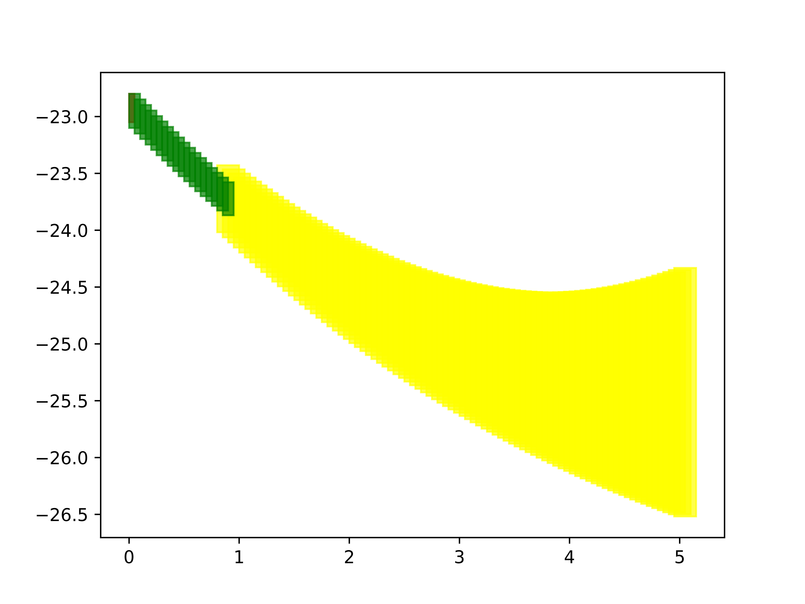
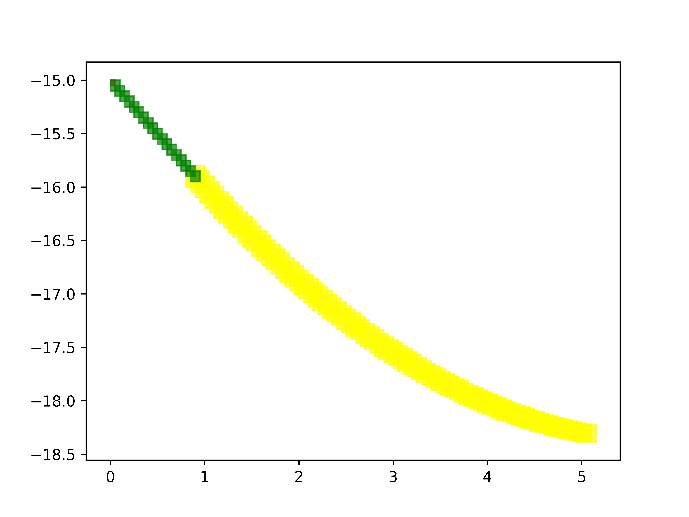

.. _example-label:

Examples
==============

A small example to get started
^^^^^^^^^^^^^^^^^^^^^^^^^^^^^^^^^^^

An example of Automatic Emergency Braking (AEB) System
--------------------------------------------------------
.. figure:: Two_cars.png
	:scale: 30%
	:align: center
	:alt: scenario graph

	An illustration of Automatic Emergency Braking System

Consider the example an AEB as shown above:
Car 1, Car2 are cruising down the highway with zero relative velocity and certain initial relative separation;  Car 1 suddenly switches to a braking mode and starts slowing down according to a certain deceleration profile. Irrespective of whether Car 2 is human-driven, AEB-equipped, or fully autonomous, certain amount of time elapses,  before Car 2 switches to a braking mode. 

Safety Verification of the AEB System
---------------------------------------
The black-box of the vehicle dynamics is described in :ref:`ADAS-label`, and the transition graph of the above AEB is shown in :ref:`transition-graph-label`. The unsafe region is that the relative distance between the two cars are too close (:math:`|sy_1-sy_2|<3`). The input files describing the hybrid system is shown in :ref:`input-format-label`.

Verification Result of the AEB System
----------------------------------------
Run DryVR's verification algorithm for the AEB system: ::
	
	python main.py inputFile/input_twocarBreak

The system is checked to be safe. We can also plot the reachtubes for different variables. For example, the reachtubes for the position of Car1 and Car2 along the road the direction are shown below. From the reachtube we can also clearly see that the relative distance between the two cars are never too small.

	Reachtube of the position sy of Car1 

	Reachtube of the position sy of Car2

.. _ADAS-label:

The Autonomous Vehicle Benchmark
^^^^^^^^^^^^^^^^^^^^^^^^^^^^^^^^^^^
The hybrid system for a scenario is constructed by putting together several individual vehicles. The higher-level decisions (paths) followed by the vehicles are captured by the transition graphs discussed in :ref:`transition-graph-label`.

Each vehicle has the following modes

- Const: move forward at constant speed, 
- Acc1: constant acceleration,
- Brk or Dec: constant (slow) deceleration,
- TurnLeft and TurnRight:  the acceleration and steering are controlled in such a manner that the vehicle switches to its left (resp. right) lane in a certain amount of time. 

The mode for the entire system consists of n vehicles are the mode of each vehicle separated by semicolon. For example, Const;Brk means the first car is in the const speed mode, while the second car is in the brake mode.
For each vehicle, we mainly analyze four variables: absolute position
(:math:`sx`) and velocity (:math:`vx`) orthogonal to the road direction
(:math:`x`-axis), and absolute position (:math:`sy`) and velocity (:math:`vy`) along the
road direction (:math:`y`-axis). The throttle and steering is captured using the four variables. 

Due to the MATLAB license issue, we are not able to release the Simulink benchmarks we have used in the publications. We have since reproduced the ADAS and autonomous vehicle benchmark in Python and connect it with DryVR as a simulator. We are hoping to move more examples to Python in the near future.

For more details, please refer to Section 2.5 of the CAV2017 paper.

Other examples
^^^^^^^^^^^^^^^^^
Next, we brief introduce other examples included in the inputFile folder and its verification results.

\item[$\auto{MergeBehind}$:] 
Initial condition:  vehicle A is in left and  vehicle B is in the right lane; initial positions and speeds are in some range;  A is in \Lmode{cruise} mode, and B is in \Lmode{cruise} or \Lmode{speedup}.
%
Transition graph:  Vehicle A  goes through the mode sequence \Lmode{speedup}, \Lmode{ch\_right}, \Lmode{cruise} with specified intervals of time to transit from mode to another mode. 
%
Requirement: A merges behind B within a time bound and maintains at least a given safe separation.

\item[$\auto{MergeAhead}$:] 
Initial condition: same as  $\auto{MergeBehind}$ with 
except that B is in \Lmode{cruise} or \Lmode{brake} mode.
Transition graph: same structure as  $\auto{MergeBehind}$ with different  timing parameters.
Requirement: A merges ahead of B and maintains at least a given safe separation. 

\item[$\auto{AutoPassing}$:]
Initial condition: vehicle A behind  B in the same lane, with A in \Lmode{speedup} and B in \Lmode{cruise}; initial positions and speeds are in some range.
Transition graph:  A goes through the mode sequence \Lmode{ch\_left}, \Lmode{speedup}, \Lmode{brake}, and  \Lmode{ch\_right}, \Lmode{cruise} with specified time intervals in each mode to complete the overtake maneuver. If B switches to
\Lmode{speedup} before A enters \Lmode{speedup} then
A aborts and changes back to right lane. If B switches to \Lmode{brake} before A enters \Lmode{ch\_left}, then A should adjust the time to switch to \Lmode{ch\_left} to avoid collision.
Requirement: vehicle A overtakes B while maintaining minimal safe separation.
