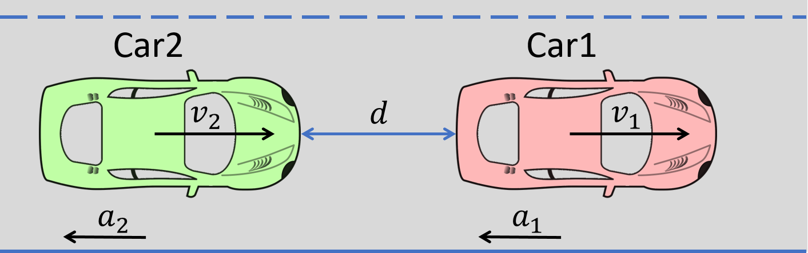

.. _example-label:

Examples
==============

A small example to get started
^^^^^^^^^^^^^^^^^^^^^^^^^^^^^^^^^^^

An example of Automatic Emergency Braking (AEB) System
--------------------------------------------------------

	An illustration of Automatic Emergency Braking System

Consider the example an AEB as shown above:
Car 1, Car2 are cruising down the highway with zero relative velocity and certain initial relative separation;  Car 1 suddenly switches to a braking mode and starts slowing down according to a certain deceleration profile. Irrespective of whether Car 2 is human-driven, AEB-equipped, or fully autonomous, certain amount of time elapses,  before Car 2 switches to a braking mode. 

The Autonomous Vehicle Benchmark
^^^^^^^^^^^^^^^^^^^^^^^^^^^^^^^^^^^
The hybrid system for a scenario is constructed by putting together several individual vehicles. The higher-level decisions (paths) followed by the vehicles are captured by the transition graphs discussed in :ref:`transition-graph-label`.

Each vehicle has the following modes

- Const: move forward at constant speed, 
- Acc1: constant acceleration,
- Brk or Dec: constant (slow) deceleration,
- TurnLeft and TurnRight:  the acceleration and steering are controlled in such a manner that the vehicle switches to its left (resp. right) lane in a certain amount of time. 

The mode for the entire system consists of n vehicles are the mode of each vehicle separated by semicolon. For example, Const;Brk means the first car is in the const speed mode, while the second car is in the brake mode.
For each vehicle, we mainly analyze four variables: absolute position
($sx$) and velocity ($vx$) orthogonal to the road direction
($x$-axis), and absolute position ($sy$) and velocity ($vy$) along the
road direction ($y$-axis). The throttle and steering is captured using
the four variables. 

Due to the MATLAB license issue, we are not able to release the Simulink benchmarks we have used in the publications. We have since reproduced the ADAS and autonomous vehicle benchmark in Python and connect it with DryVR as a simulator. We are hoping to move more examples to Python in the near future.

For more details, please refer to Section 2.5 of the CAV2017 paper.

Other examples
^^^^^^^^^^^^^^^^^
Next, we brief introduce other examples included in the inputFile folder and its verification results.

MergeBetween

Initial condition: car1, car2, car3 are all in the same lane, with car1 behind car2, car2 behind car3, and in the Const mode, initial positions and speeds are in some range.

Transition graph: car1 goes through the mode sequence TurnLeft, Acc1, Dec, and TurnRight, Const with specified time intervals in each mode to overtake car2. car3 transits from Const to Acc1 then transits back to Const, so car3 is always ahead of car1.

Requirement: car1 merges between car2 and car3 and any two vehicles maintain at least a given safe separation.

InputFiles: input_threeCar(safe), input_threeCarUnsafe(unsafe)

Merge

Initial condition: car1 is in left and car2 is in the right lane; initial positions and speeds are in some range; car1 is in Const mode, and car2 is in Const mode.

Transition graph:  car1 goes through the mode Acc1, TurnRight, Const with specified intervals of time to transit from mode to another mode. car2 goes through the mode Acc1 or Const, TurnRight, Const with specified intervals of time to transit from mode to another mode. Car1 will merge ahead of car2 of behind of car2 based on cars's mode transition.

Requirement: car1 merges ahead or behind of car2 and maintains at least a given safe separation. 

InputFiles: input_carMerge(safe), input_carMerge(unsafe)

AutoPassing

Initial condition: car1 behind car2 in the same lane, with car1 in Acc1 and car2 in Const; initial positions and speeds are in some range.

Transition graph:  car1 goes through the mode sequence TurnLeft, Acc1, Brk, and  TurnRight, Const with specified time intervals in each mode to complete the overtake maneuver. If car2 switches to Acc1 before car1 enters Acc1 then car1 aborts and changes back to right lane. If car2 switches to Dec before car1 enters TurnLeft, then car1 should adjust the time to switch to TurnLeft to avoid collision.

Requirement: car1 overtakes car2 while maintaining minimal safe separation.
